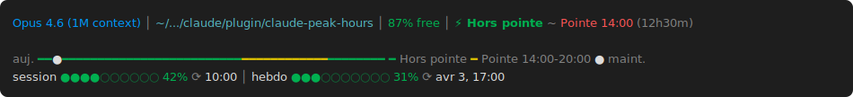
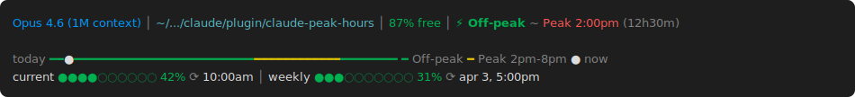

# claude-peak-hours

[](LICENSE)
[]()
[](https://github.com/nickywan/claude-peak-hours/actions)

A [Claude Code](https://claude.ai/code) statusline plugin that shows whether you're in **peak** or **off-peak** hours, with a countdown to the next transition.

During peak hours (12:00-18:00 UTC / 8AM-2PM ET on weekdays), Anthropic applies stricter session limits and tokens are consumed faster. This statusline shows you exactly when you're in peak, when it changes, and helps you plan your usage.

Inspired by [isclaude-2x](https://github.com/Adiazgallici/isclaude-2x).

## Install

Clone and install:

```bash
git clone https://github.com/nickywan/claude-peak-hours.git
cd claude-peak-hours
node bin/install.js
```

Restart Claude Code after installing.

### Options

```bash
node bin/install.js                          # minimal (default)
node bin/install.js --full                   # dashboard with timeline + rate limits
node bin/install.js --24h                    # force 24h time format
node bin/install.js --12h                    # force 12h time format
node bin/install.js --lang fr                # French labels
node bin/install.js --full --24h --lang fr   # combined
node bin/install.js --uninstall              # restore previous statusline
```

## Modes

### Minimal (default)

One line. Everything you need at a glance.

**Off-peak (French, 24h):**


**Off-peak (English, 12h):**


Shows: model name, current directory, context remaining %, peak status with countdown.

### Full (`--full`)

Dashboard with visual timeline and real-time rate limits.

**Full mode (French, 24h):**



**Full mode (English, 12h):**



The timeline bar shows your full day in local time -- green for off-peak hours, yellow for peak hours, and a white dot for where you are now.

Rate limits (session 5h + weekly) are read directly from Claude Code -- no extra API calls, zero latency.

## Localization

Supports English (default) and French. Auto-detected from your locale, or forced with `--lang`.

## Time format

Auto-detected from locale (French -> 24h, English -> 12h), or forced with `--24h` / `--12h`.

## Remote config

Peak hours are loaded from a [remote config file](peak-hours.json) on this repo, cached locally for 1 hour. If Anthropic changes peak hours, updating this file updates all users automatically -- no plugin update needed.

Falls back to hardcoded defaults (Mon-Fri 12:00-18:00 UTC) if the fetch fails.

### Config format

```json
{
  "version": 2,
  "peak_windows": [
    { "days": [1, 2, 3, 4, 5], "start_utc": 12, "end_utc": 18 }
  ]
}
```

All times are in UTC. Multiple windows supported. `end_utc` < `start_utc` means the window crosses midnight.

## How it works

- Loads peak hours config from GitHub (cached 1h, hardcoded fallback)
- All peak calculations done in **UTC** -- no DST ambiguity
- Converts to your local timezone for display
- Rate limits read directly from Claude Code stdin (no network calls)
- Supports multiple peak windows and midnight-crossing windows

## Requirements

- **macOS or Linux**
- **Node.js** -- for the installer only
- **jq** -- `brew install jq` or `sudo apt install jq`
- **curl** -- pre-installed on most systems

## Contributing

This project is not open to external contributions. See [CONTRIBUTING.md](CONTRIBUTING.md) for details.

If you notice Anthropic changed their peak hours, please [open an issue](https://github.com/nickywan/claude-peak-hours/issues) and we'll update the config.

## Security

This is a read-only statusline plugin. It does **not**:
- Send your data anywhere (except fetching the public config from this repo)
- Store credentials (it reads existing Claude Code data from stdin)
- Modify your code or files (except `~/.claude/settings.json` and `~/.claude/statusline.sh` during install)

If you find a security issue, please open a [private security advisory](https://github.com/nickywan/claude-peak-hours/security/advisories/new) instead of a public issue.

## License

[MIT](LICENSE)
